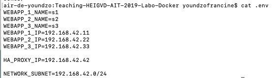
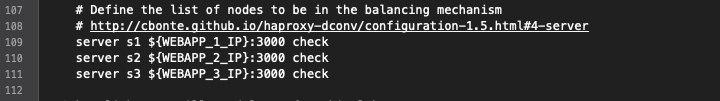
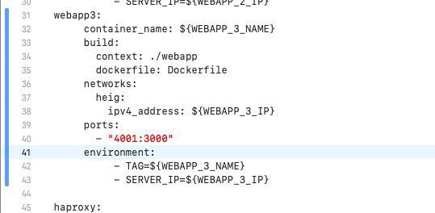
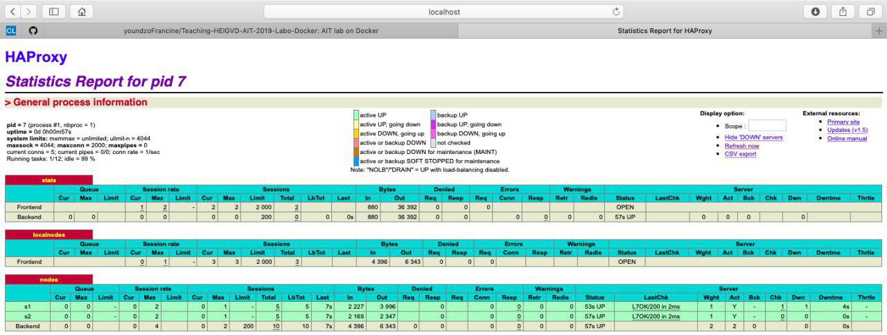
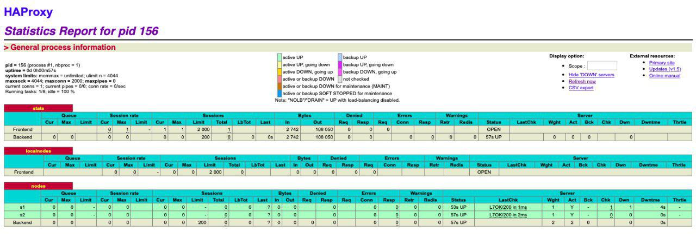
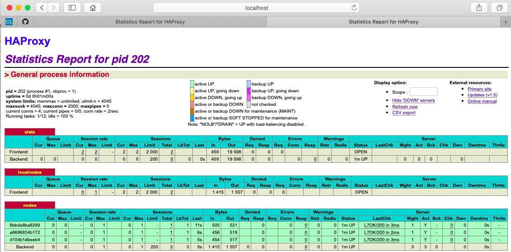
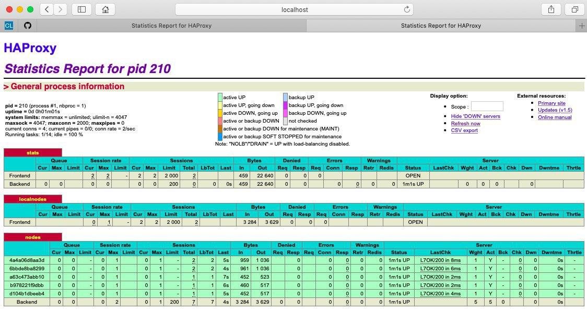
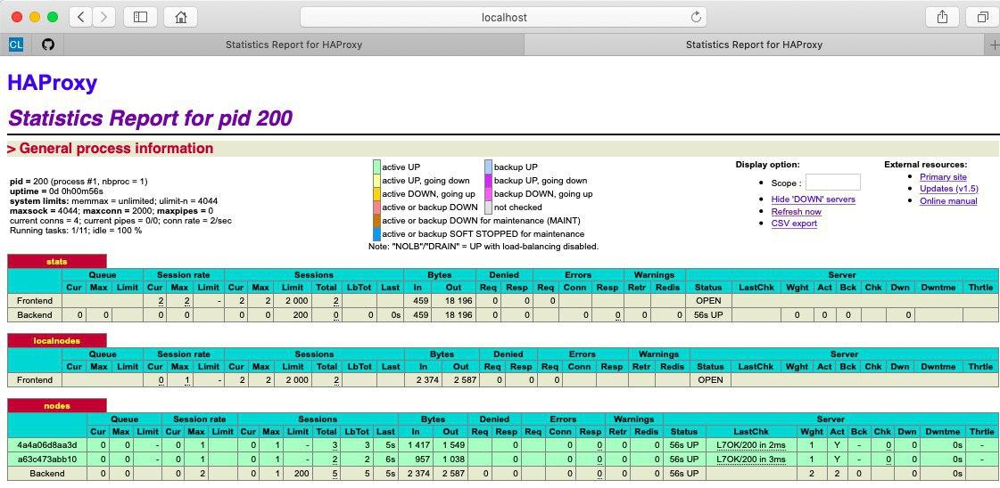



# Lab 04 - Docker

#### Authors : Crescence Yimnaing && Francine Youndzo

#### Date : 11.12.2019

---

#### Pedagogical objectives

* Build our own Docker images

* Become familiar with lightweight process supervision for Docker

* Understand core concepts for dynamic scaling of an application in production

* Put into practice decentralized management of web server instances

#### Introduction:

In this lab, we will find many solutions to solve problems encounter with the achitecture developped in the previous lab. The objectif is to reconfigure and generate configurations files automatically, and be able to add or remove as much as end nodes webb servers we want to our infrastructure without need to reconfigure the HAProxy.


#### Task 0: Identify issues and install the tools.

1. <a name="M1"></a>**[M1]** Do you think we can use the current
   solution for a production environment? What are the main problems
   when deploying it in a production environment?
   
   **In the previous lab solution we cannot dynamically add and remove web servers. To do this, we must manually reconfigure the HAProxy to inform it if a Webb server is added or removed. So No, we can use the solution from the previous laboratory in a production environment.**

2. <a name="M2"></a>**[M2]** Describe what you need to do to add new
   `webapp` container to the infrastructure. Give the exact steps of
   what you have to do without modifiying the way the things are
   done. Hint: You probably have to modify some configuration and
   script files in a Docker image.
   
   **-We have modify the .env file by adding the ip address of the container s3 to add.**
   

   
   **-Modification of the config haproxy.cfg file by adding the last line to match the container with its ip address.**
   


   **-Modification of docker-compose.yml to launch s3 at the same time as s1, s2 and ha**



3. <a name="M3"></a>**[M3]** Based on your previous answers, you have
   detected some issues in the current solution. Now propose a better
   approach at a high level.
   
   **This solution is not good because we are doing update manually. The issue must be to do update automatically. Like we will do so far in this lab, we can write a script that will edit and run automatically the HAProxy when this one will be informed by a ``serf agent`` if a node is added or removed to the infrastructure.**

4. <a name="M4"></a>**[M4]** You probably noticed that the list of web
    application nodes is hardcoded in the load balancer
    configuration. How can we manage the web app nodes in a more dynamic
    fashion?
    
    **As we will see in Task 5 of this lab, we can write two scripts ``join`` and ``leave``  that will generate a proper HAProxy configuration file.**

5. <a name="M5"></a>**[M5]** In the physical or virtual machines of a
   typical infrastructure we tend to have not only one main process
   (like the web server or the load balancer) running, but a few
   additional processes on the side to perform management tasks.
    
   **With the current solution, it is not possible to run additional management processes beside the main web server / load balancer process in a container. Because the central tenet of the Docker design is the following principle ``One process per container``. The issue of this problem is to install a process supervisor.**
   
6. <a name="M6"></a>**[M6]** In our current solution, although the
   load balancer configuration is changing dynamically, it doesn't
   follow dynamically the configuration of our distributed system when
   web servers are added or removed. If we take a closer look at the
   `run.sh` script, we see two calls to `sed` which will replace two
   lines in the `haproxy.cfg` configuration file just before we start
   `haproxy`. You clearly see that the configuration file has two
   lines and the script will replace these two lines.
   
   **If we add more server nodes, we must also add more lines with the command ``sed`` in the ``run.sh`` script. For example, if we add server node s3, we must add line ``sed -i 's/<s3>/$S3_PORT_3000_TCP_ADDR/g' /usr/local/etc/haproxy/haproxy.cfg``in the ``run.sh`` script.This solution is not dynamic. To solve this problem, we can use a template engine to easily generate configuration files like we will see in task 4 of this lab.**
   
   
   Deliverables:

    Take a screenshot of the stats page of HAProxy at http://192.168.42.42:1936. You should see your backend nodes.
    
    


    Give the URL of your repository URL in the lab report.

#### Task 1: Add a process supervisor to run several processes

**Deliverables**:

1. Take a screenshot of the stats page of HAProxy at
   <http://192.168.42.42:1936>. You should see your backend nodes. It
   should be really similar to the screenshot of the previous task.
   
   


2. Describe your difficulties for this task and your understanding of
   what is happening during this task. Explain in your own words why
   are we installing a process supervisor. Do not hesitate to do more
   research and to find more articles on that topic to illustrate the
   problem.
   
   **Normally, there is only a single process running inside a container. Consequently, the container will run only when the process is running. This means that when the process stops, the container automatically stops as well. To solve this problem, we need to run several processes at the same time in a container. To achieve this, we need to have process supervisor. So we install an init system called s6 in the Docker images of HAProxy and Web applications, and we configure it as our main process replacing the current one. The problen here is that when doing this, we don't have no more applications. To remedy to this, we create a folder services in HAProxy and Webb applications where we copy the starting scripts for s6, making the applications available again. We then copy these scripts in to the right pace in our Docker images and run them.**
   

#### Task 2: Add a tool to manage membership in the web server cluster

1. Provide the docker log output for each of the containers: ha, s1 and s2.    You need to create a folder logs in your repository to store the files      separately from the lab report. For each lab task create a folder and       name it using the task number. No need to create a folder when there are    no logs.

   You will find in the directory `logs/task_2` files containing Docker log output of each container ha, s1 and s2.

2. Give the answer to the question about the existing problem with the         current solution.

    The problem here is the way we kill the serf agent, by trapping the SIGTERM and in place running the function that will kill the process.
    Also, in the current solution, all nodes created after the first node will attach to the cluster created by this first node through this one. For example, if we start ha first, then s2 and finally s1, ha will connect to itself as it is the first one and create a cluster, then s1 and s2 will join this cluster through ha. The problem with this solution is that if ha leaves the cluster, all the nodes created after could not join the cluster since they can't see their reference node, and this is not normal because the cluster still exists with nodes s1 and s2. The solution we propose is that since we are in a decentralized architecture, all news nodes created should reference the last node that have joined the cluster, and not the first node that create the cluster. Thus since this node have the ip address of the node that it refences, this last node can join it if the node it references has left the cluster and so on

3. Give an explanation on how Serf is working. Read the official website to    get more details about the GOSSIP protocol used in Serf. Try to find        other solutions that can be used to solve similar situations where we       need some auto-discovery mechanism.

    Serf uses a gossip protocol to broadcast messages to the cluster. Serf begins by joining an existing cluster or starting a new cluster. If starting a new cluster, additional nodes are expected to join it. New nodes in an existing cluster must be given the address of at least one existing member in order to join the cluster. The new member does a full state sync with the existing member over TCP and begins gossiping its existence to the cluster.
    
    **Source:** [here](https://www.serf.io/docs/internals/gossip.html)
   
   
#### Task 3: React to membership changes
 
 **Deliverables**:

1. Provide the docker log output for each of the containers:  `ha`, `s1` and `s2`.
   Put your logs in the `logs` directory you created in the previous task.
   
   **You will find in the directory logs/task_3 files containing Docker log output of each container ha, s1 and s2**

2. Provide the logs from the `ha` container gathered directly from the `/var/log/serf.log`
   file present in the container. Put the logs in the `logs` directory in your repo.  
   
   You will find this output in the file ``ha_logs_inside``

#### Task 4: Use a template engine to easily generate configuration files

**Deliverables**:

1. You probably noticed when we added `xz-utils`, we have to rebuild
   the whole image which took some time. What can we do to mitigate
   that? Take a look at the Docker documentation on
   [image layers](https://docs.docker.com/engine/userguide/storagedriver/imagesandcontainers/#images-and-layers).
   Tell us about the pros and cons to merge as much as possible of the
   command. In other words, compare:

  ```
  RUN command 1
  RUN command 2
  RUN command 3
  ```

  vs.

  ```
  RUN command 1 && command 2 && command 3
  ```

  There are also some articles about techniques to reduce the image
  size. Try to find them. They are talking about `squashing` or
  `flattening` images.
  
  **It is preferable to use the second example, because if ``RUN command 1`` fails to execute, ``command 2`` and ``command 3`` wil not be executed.So this will facilitate the building of our image. But, in the first example, the execution of each command is independent of the execution of the previous one.**
  **To reduce the size of ours docker images, we can use ``docker-squash``.**   
  **You can learn more [here](https://github.com/jwilder/docker-squash)**

2. Propose a different approach to architecture our images to be able
   to reuse as much as possible what we have done. Your proposition
   should also try to avoid as much as possible repetitions between
   your images.

   **Different approach to architecture our images to be able to reuse as much as possible what we have done.** 
   **Maximize Your Docker Image Caching Techniques. You can learn more [here](https://www.ctl.io/developers/blog/post/more-docker-image-cache-tips/)**

3. Provide the `/tmp/haproxy.cfg` file generated in the `ha` container
   after each step.  Place the output into the `logs` folder like you
   already did for the Docker logs in the previous tasks. Three files
   are expected.
   
   In addition, provide a log file containing the output of the 
   `docker ps` console and another file (per container) with
   `docker inspect <container>`. Four files are expected.
   
   **All necessaries files are given in the directory: ``logs/task_4``**
   
4. Based on the three output files you have collected, what can you
   say about the way we generate it? What is the problem if any?
   
   **The configuration files just give informations about the last container that has joined the cluster. It erase the informations about the previous nodes that have joined the cluster. The problem is that we do not write after the contents of the file but we replace its contain with the new information. So we cannot have informations of all nodes in the cluster.**
   
   
#### Task 5: Generate a new load balancer configuration when membership changes
   
   **Deliverables**:

1. Provide the file `/usr/local/etc/haproxy/haproxy.cfg` generated in
   the `ha` container after each step. Three files are expected.
   
    In addition, provide a log file containing the output of the 
   `docker ps` console and another file (per container) with
   `docker inspect <container>`. Four files are expected.
   
   **- After running ha: ``logs/task_5/haproxy.cfg``**
   
   **- After running s1: ``logs/task_5/haproxy_s1.cfg``**
   
   **- After running s2: ``logs/task_5/haproxy_s2.cfg``**
   
   **- File containing output of ``docker ps``: ``logs/task_5/docker_ps``**
   
   **- File containing output of ``docker inspect``: ``logs/task_5/docker_inspect_ha``, ``logs/task_5/docker_inspect_s1``, ``logs/task_5/docker_inspect_s2``**

2. Provide the list of files from the `/nodes` folder inside the `ha` container.
   One file expected with the command output.
    
**- File ``logs/task_5/list_of_node``**

3. Provide the configuration file after you stopped one container and
   the list of nodes present in the `/nodes` folder. One file expected
   with the command output. Two files are expected.
   
   **Configuration file after we stop s1 : ``logs/task_5/haproxy_after_s1_stop`**
   **List of nodes: ``logs/task_5/list_of_nodes_after_s1_stop``**
   
    In addition, provide a log file containing the output of the 
   `docker ps` console. One file expected.
   
    **- File ``logs/task_5/docker_ps_after_s1_stop``**

#### Task 6: Make the load balancer automatically reload the new configuration

   **Deliverables**:

1. Take a screenshots of the HAProxy stat page showing more than 2 web
   applications running. Additional screenshots are welcome to see a
   sequence of experimentations like shutting down a node and starting
   more nodes.
   
   Also provide the output of `docker ps` in a log file. At least 
   one file is expected. You can provide one output per step of your
   experimentation according to your screenshots.

   **- Screenshot of HAProxy stat page showing 3 nodes**
   
    

   **- docker ps output file: ``logs/task_6/docker_ps_3_nodes``**
   
   **- Screenshot of HAProxy stat page showing 5 nodes**
  
    

   **- docker ps output file: ``logs/task_6/docker_ps_5_nodes``**
   
   **Screenshot of HAProxy stat page showing 2 nodes ``ha``, ``s1`` and ``s2`` removed**
  
   

   **- docker ps output file: ``logs/task_6/docker_ps_remove_3_nodes``**
   
2. Give your own feelings about the final solution. Propose
   improvements or ways to do the things differently. If any, provide
   references to your readings for the improvements.
   
   **In this final solution, we have noticed that if we just have one back end node, the session id increment as we access and refresh the URL <http://localhost>. But if we have more than one node webb server, the session id doesn't increment, the requests are  forwarded to each node consecutivelly, but when the same request is forwarded again to the same node, its session id doesn't increment. And this is not normal.**


    #### Conclusion:

    This lab was very instructive, since first of all it make us familiar with many docker commands (to build, run and stop containers), but from now, we are able to build an infrastructure with many processes running in a container by using a serf agent and configure automatically our HAProxy after avry events happening.