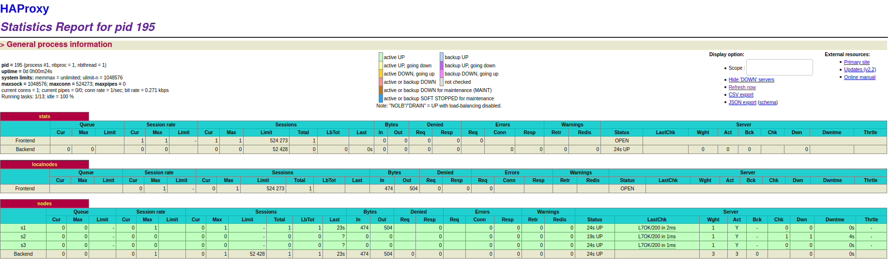

title: Lab 04 - Docker
---

## Lab 04 - Docker

0. [Identify issues and install the tools](#task-0)
1. [Add a process supervisor to run several processes](#task-1)
2. [Add a tool to manage membership in the web server cluster](#task-2)
3. [React to membership changes](#task-3)
4. [Use a template engine to easily generate configuration files](#task-4)
5. [Generate a new load balancer configuration when membership changes](#task-5)
6. [Make the load balancer automatically reload the new configuration](#task-6)

## Introduction
Dans ce laboratoire nous allons voir comment scaller dynamiquement notre infrastructure lorsqu'on détecte un node ou un node tombe. Nous allons utiliser les paramètre de Haproxy et de multiple manipulation lié à Docker.
## Tâches

### Tâche 0

1. **[M1]** *Do you think we can use the current solution for a production environment? What are the main problems when deploying it in a production environment?*

- Pour ajouter un nouveau serveur, il est nécessaire de l'ajouter manuellement dans la  configuration de HAProxy
- Le système repose sur un seul proxy. En cas de forte demande, celui-ci peut aussi tomber

1. **[M2]** *Describe what you need to do to add new `webapp` container to the infrastructure. Give the exact steps of what you have to do without modifiying the way the things are done. Hint: You probably have to modify some configuration and script files in a Docker image.*

####  docker-compose.yml

Ajouter une webapp3 en modifiant les paramètres qui lui sont propres comme :

- Le nom du container
- Son adresse IP
- Son port

```yaml
   webapp3:
       container_name: ${WEBAPP_3_NAME}
       build:
         context: ./webapp
         dockerfile: Dockerfile
       networks:
         heig:
           ipv4_address: ${WEBAPP_3_IP}
       ports:
         - "4002:3000"
       environment:
            - TAG=${WEBAPP_3_NAME}
            - SERVER_IP=${WEBAPP_3_IP} 
```

Toujours dans le même fichier, ajouter dans la partie environnement  webapp3

```yaml
  environment:
            - WEBAPP_1_IP=${WEBAPP_1_IP}
            - WEBAPP_2_IP=${WEBAPP_2_IP}
            - WEBAPP_3_IP=${WEBAPP_3_IP}
```

#### haproxy.cfgc

Dans haproxy.cfgc, il faut ajouter le serveur 3 :

```bash
server s3 ${WEBAPP_3_IP}:3000 check
```

### .env

Dans le fichier .env, il faut ajouter également webapp_3

```.env
WEBAPP_1_NAME=s1
WEBAPP_2_NAME=s2
WEBAPP_3_NAME=s3

WEBAPP_1_IP=192.168.42.11
WEBAPP_2_IP=192.168.42.22
WEBAPP_3_IP=192.168.42.33

HA_PROXY_IP=192.168.42.42

NETWORK_SUBNET=192.168.42.0/24
```


1. **[M3]** *Based on your previous answers, you have detected some issues in the current solution. Now propose a better approach at a high level.*

Il y a plusieurs fichiers à modifier pour ajouter le serveur, ce qui n'est pas pratique

1. **[M4]** *You probably noticed that the list of web application nodes is hardcoded in the load balancer configuration. How can we manage the web app nodes in a more dynamic fashion?*

2. **[M5]** *In the physical or virtual machines of a typical infrastructure we tend to have not only one main process (like the web server or the load balancer) running, but a few additional processes on the side to perform management tasks.*

   *For example to monitor the distributed system as a whole it is common to collect in one centralized place all the logs produced by the different machines. Therefore we need a process running on each machine that will forward the logs to the central place. (We could also imagine a central tool that reaches out to each machine to gather the logs. That's a push vs. pull problem.) It is quite common to see a push mechanism used for this kind of task.*

   *Do you think our current solution is able to run additional management processes beside the main web server / load balancer process in a container? If no, what is missing / required to reach the goal? If yes, how to proceed to run for example a log forwarding process?*

3. **[M6]** *In our current solution, although the load balancer configuration is changing dynamically, it doesn't follow dynamically the configuration of our distributed system when web servers are added or removed. If we take a closer look at the `run.sh` script, we see two calls to `sed` which will replace two lines in the `haproxy.cfg` configuration file just before we start `haproxy`. You clearly see that the configuration file has two lines and the script will replace these two lines.*

   *What happens if we add more web server nodes? Do you think it is really dynamic? It's far away from being a dynamic configuration. Can you propose a solution to solve this?*

**Deliverables :**

1. Take a screenshot of the stats page of HAProxy at [http://192.168.42.42:1936](http://192.168.42.42:1936/). You should see your backend nodes.

   

2. Give the URL of your repository URL in the lab report.

   URL du repo git : [https://github.com/Tchewi/AIT-Labo4-Docker-and-dynamic-scaling](https://github.com/Tchewi/AIT-Labo4-Docker-and-dynamic-scaling)

### Task1 - Add a process supervisor to run several processes

**Deliverables**:

1. *Take a screenshot of the stats page of HAProxy at [http://192.168.42.42:1936](http://192.168.42.42:1936/). You should see your backend nodes. It should be really similar to the screenshot of the previous task.*



2. *Describe your difficulties for this task and your understanding of what is happening during this task. Explain in your own words why are we installing a process supervisor. Do not hesitate to do more research and to find more articles on that topic to illustrate the problem.*

L'installation d'un processus superviseur nous donne la possibilité de lancer de mupltiples processus en même temps dans un environnement docker.

Pour ce faire, dans cette tâches, nous avons installé **s1**, un `init system`permettant de gérer des deamons et coordonner les processus boot.

### Task 2: Add a tool to manage membership in the web server cluster

1. *Provide the docker log output for each of the containers: `ha`,*
   *`s1` and `s2`. You need to create a folder `logs` in your*
   *repository to store the files separately from the lab*
   *report. For each lab task create a folder and name it using the*
   *task number. No need to create a folder when there are no logs.*

   Example:

   ```
   |-- root folder
     |-- logs
       |-- task 1
       |-- task 3
       |-- ...
   ```

2. *Give the answer to the question about the existing problem with the*
   *current solution.*
   

Le problème est que nous indiquons aux nodes de rejoindre la node ha. Cela ne fonctionne que si ha est up quand les autres viennent. Il faudrait que les nodes arrivent à rejoindre d'eux même.

3. *Give an explanation on how `Serf` is working. Read the official*
   *website to get more details about the `GOSSIP` protocol used in*
   *`Serf`. Try to find other solutions that can be used to solve*
   *similar situations where we need some auto-discovery mechanism*.

Chaque container aura un Serf Agent (Load Balancer et web app). L'agent serf utilise un protocole peer-to-peer pour échanger des informations au sein d'un cluser de nodes. Les informations échangées sont ;

- L'existence des nodes dans le cluster
- Leur adresse IP

Quand un node disparait ou apparait du cluserm c'est le Serf Agent qui informe  les autres nodes de l'événements.

### Tâche 3


### Tâche 4

1. *You probably noticed when we added `xz-utils`, we have to rebuild the whole image which took some time. What can we do to mitigate that? Take a look at the Docker documentation on [image layers](https://docs.docker.com/engine/userguide/storagedriver/imagesandcontainers/#images-and-layers). Tell us about the pros and cons to merge as much as possible of the command. In other words, compare:*

```
RUN command 1
RUN command 2
RUN command 3
```

vs.

```
RUN command 1 && command 2 && command 3
```

There are also some articles about techniques to reduce the image size. Try to find them. They are talking about `squashing` or `flattening` images.

2. *Propose a different approach to architecture our images to be able to reuse as much as possible what we have done. Your proposition should also try to avoid as much as possible repetitions between your images.*

3. *Provide the `/tmp/haproxy.cfg` file generated in the `ha` container after each step. Place the output into the `logs` folder like you already did for the Docker logs in the previous tasks. Three files are expected.*

*In addition, provide a log file containing the output of the `docker ps` console and another file (per container) with `docker inspect <container>`. Four files are expected.*

4. *Based on the three output files you have collected, what can you say about the way we generate it? What is the problem if any?*

Nous les générérons ou les récupérons manuellement ce qui est peu efficace. Par exemple pour les logs `/tmp/haproxy.cfg`, il faut se connecter dans le docker pour le copier/afficher. Pour les logs des commandes `docker inspect`, on doit exécuter la commande pour chaque conteneur.

### Tâche 5


### Difficultés

### Conclusion
